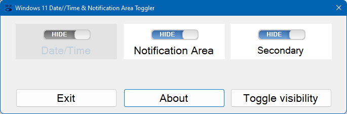

# Win11ClockToggler

One of the many bummers in **Windows 11** is **the inability to hide the date/time** in the taskbar. This is really an annoyance if you create screen recordings or tutorials and don't want the clock to be shown in your final video.

After waiting for months for Microsoft to fix this issue, I decided to write this small and fast little tool: **Win11ClockToggler**.

> 🎉 **NEW 2.0 VERSION**: enhanced functionality. New graphical version for ease of use.

Win11ClockToggler allows you to **hide the full notification area, or just the clock**, in the Windows 11 taskbar.

Get the app **[from the "Releases" section](https://github.com/jmalarcon/Win11ClockToggler/releases)** on the right (only x64 versions vailable).

There are **two ZIP files** that you can download and unzip to any folder in your computer:

- **Win11ClockTogglerGUI.exe.zip**: the graphical version, suitable for most of the users.
- **Win11ClockTogglerCLI.zip**: a command line interface version.

## GUI Version

It's a graphical user interface version. Just double-click on the `Win11ClockTogglerGUI.exe` file. A new window will appear:

You need to check what parts do you want to show or hide clicking on each available slider and then clicking on the `Toggle visibility` button:

Notice that Date/Time is disabled and always will be chosen to be hidden, because it's the main purpose of the app. The `Secondary` toggle will be only enabled if there are secondary toolbars in available in secondary screens. It will keep your last selections the next time you run it, so that you don't need to toggle then every time.

> In my opinion it's better to hide the full notification area by default, since it will hide all the distracting icons, which is good if you're recording your screen for a tutorial.

When you click the `Toggle visibility` button, the selected elements will be hidden and the `Exit` button will change to `Restore & Exit`. This is because, **when you exit the app, everything will be restored back to normal**. The reason for this is that, while the app is running it will **keep monitoring the hidden areas just in case they show up again**. When a new icon is added to the notification area or when a new notification enters, the system makes everything visible again. This app will monitor this events and will instantly hide again what's selected. That's the reason for keeping the app running while you hide those elements.

> **The app is not visible in the toolbar** so it's won't be visible while you're recording your screen unless you use `ALT`+`Tab` or `Windows`+`Tab` change tasks. You can move it to a secondary screen or to a different desktop, but if you **minimize the app or press `Windows`+`Shift`+`F7`** it will go completely hidden (**stealth mode**). Kudos to [@timmolderez](https://github.com/timmolderez) for [adding](https://github.com/jmalarcon/Win11ClockToggler/commit/1716fba34438e275b8d3f36734d46fd499b3ce9e) this feature.

You can toggle visibility just by pressing `ENTER` and leave the app (and restore the visibilities) by pressing `ESC`.

> You can toggle visibility by pressing the `Windows`+`Shift`+`F6` global hotkey combination. This works even in stealth mode. Kudos again to @timmolderez.

It will check for new version (once per day maximum) when you start it, showing a notice that you can click in order to download the new version:

> **Tip**: you can pin it to the start menu (right-click on the `.exe` file and choose `Pin to start`) to run it quickly whenever you need. In that case my advise would be to copy the folder with the `.exe` and the `.config` files to your `Program files` folder in `C:\` (or the default system letter of your drive).

### CLI Version

This is a simpler version of the app that will allow you to use it from the command line:

- **run it once**, and **the full notification area will disappear** (this is the default option, which I find more useful, but you can change it. More about it later...)
- **Run it again to restore** everything to its normal state.

Anyway, **if you just want to hide the clock** and not the full notification area,  you can use the `-c`, `/c` or **`--clock` switch**, running it from the command line or PowerShell (or a .bat or .ps1 file). 

> **IMPORTANT**: In this case it will hide both **the clock and the system icons** in Windows 11. This is due to how the new Windows 11 taskbar works internally, exposing to the Win32 API the whole system icon are (as a `Windows.UI.Composition.DesktopWindowContentBridge`, with an underlying XAML UI for that). if you know how to overcome this, please, fork this repo and make a Pull Request that I'll gladly merge :blush:

The full list of arguments you can use from the command line or PowerShell are:

- **`-h`, `/h`, `--help`**: show help
- **`-n`, `/n`, `--notificationArea`**: hides/shows the full notification area, not just the date/time. This is the **default option**, so you don't need to really use it unless you want to be explicit in a script or something
- **`-c`, `/c`, `--clock`**: hides/shows just the clock (date/time, **and** system icons)
- **`-s`**, **`/s`**, **`--secondary`**: hides/shows the secondary screen's date/times too (new in Windows 11 [KB5010414, Feb.15 2022](https://support.microsoft.com/en-us/topic/february-15-2022-kb5010414-os-build-22000-527-preview-73e259d0-45ca-45ef-960f-426035104e73)). By default it will only hide the date/time in the main screen.
- **`-b`, `/b`, `--batch`**: doesn't wait for a key to be pressed after running. Useful to include the tool in a script file.

> **VERY IMPORTANT**: with the CLI version, if you receive any notifications while the date/time or the notification area are hidden, they will automatically show up again. This is how Windows works. If you're recording your screen, the best way to go anyway **even if you're using the GUI app**, is to activate the `Focus Assist` feature of Windows 11, and set it to `Alarms only`. In that way notifications won't disturb you, won't be on the screen recording, and won't make the date/time or notification area appear again if you're using the CLI version.
>
>The fastest way to enable it is by clicking on the system icons and then the `Focus Assist` switch twice, like this:
>
>

If you find any kind of problem using it, maybe is because of new updates to Windows 11 that break compatibility. In thar case, please, open an issue here to tell me about it. Thanks.
