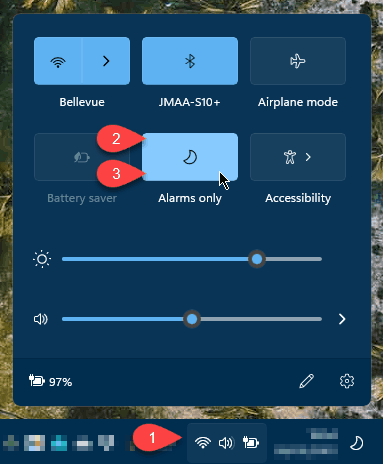

# Win11ClockToggler

One of the many bummers in **Windows 11** is **the inability to hide the date/time** in the taskbar. This is really an annoyance if you create screen recordings or tutorials and don't want the clock to be shown in your final video.

After waiting for months for Microsoft to fix this issue, I decided to write this small and fast little command line tool: **Win11ClockToggler**.

Win11ClockToggler searches and hides the full notification area, or just the clock, in the Windows 11 taskbar.

- Get the compiled app [from the "Releases" section](https://github.com/jmalarcon/Win11ClockToggler/releases) on the right. Download the latest version ZIP, and unzip it to any folder in your computer.
- Double-click it to **run it once**, and **the full notification area will disappear** (this is the default option, which I find more useful, but you can change it. More about it later...)
- **Run it again to restore** everything to its normal state.

>**Tip**: you can pin it to the start menu (right-click on the `.exe` file and choose `Pin to start`) to run it quickly whenever you need. In that case my advise would be to copy the folder with the `.exe` and the `.config` files to your `Program files` folder in `C:\` (or the default system letter of your drive).

In my opinion it's better to hide the full notification area by default, since it will hide all the distracting icons, which is good if you're recording your screen for a tutorial.

Anyway, **if you just want to hide the clock** and not the full notification area,  you can use the `-c`, `/c` or **`--clock` switch**, running it from the command line or PowerShell (or a .bat or .ps1 file). 

> **IMPORTANT**: In this case it will hide both **the clock and the system icons** in Windows 11. This is due to how the new Windows 11 taskbar works internally, exposing to the Win32 API the whole system icon are (as a `Windows.UI.Composition.DesktopWindowContentBridge`, with an underlying XAML UI for that). if you know how to overcome this, please, fork this repo and make a Pull Request that I'll gladly merge :blush:

The full list of arguments you can use from the command line or PowerShell are:

- **`-h`, `/h`, `--help`**: show help
- **`-n`, `/n`, `--notificationArea`**: hides/shows the full notification area, not just the date/time. This is the **default option**, so you don't need to really use it unless you want to be explicit in a script or something
- **`-c`, `/c`, `--clock`**: hides/shows just the clock (date/time, **and** system icons)
- **`-s`**, **`/s`**, **`--secondary`**: hides/shows the secondary screen's date/times too (new in Windows 11 [KB5010414, Feb.15 2022](https://support.microsoft.com/en-us/topic/february-15-2022-kb5010414-os-build-22000-527-preview-73e259d0-45ca-45ef-960f-426035104e73)). By default it will only hide the date/time in the main screen.
- **`-b`, `/b`, `--batch`**: doesn't wait for a key to be pressed after running. Useful to include the tool in a script file.

> **VERY IMPORTANT**: if ypou receive any notifications while the date/time or the notification area are hidden, they will automatically show up again. This is how Windows works. I'll try to make a fix for it, but the best way to go anyway, if you're recording your screen, is to activate the `Focus Assist` feature of Windows 11, and set it to `Alarms only`. In that way notifications won't disturb you (and won't make the date/time appear again).
>
>The fastest way to enable it is by clicking on the sustem icons and then the `Focus Assist` switch twice, like this:
>
>

It works for **Windows 10** too, but it will always hide the full notification area. If you just want to hide the clock in Windows 10, you already have native support for it in the notifications' configuration of the Windows Settings app. I don't test it thoroughly in Windows 10, so I don't recommend using it with it. It's a Windows 11 tool.

If you find any kind of problem using it, maybe is because of new updates to Windows 11 that break compatibility. In thar case, please, open an issue here to tell me about it. Thanks.
