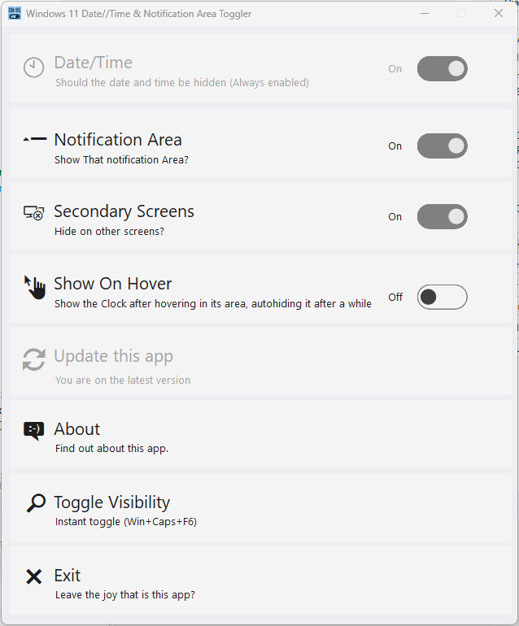

# Win11ClockToggler

> ⁉️**WARNING** (March 3rd 2023):  Windows 11 22H2 v22621.1344, released in March 2023 has changed the way the toolbar works internally and the "hacks" I needed to to for this to work, **don't work anymore**. I've not found a way to overcome the difficulty so, unfortunately, **this app only works with Windows 11 < 22H2 v22621.1344** and Windows 10. Sorry. If I ever found a way to fix it or if they release a new "more conventional" toolbar in a new update, I'll keep you posted.

One of the many bummers in **Windows 11** is **the inability to hide the date/time** in the taskbar. This is really an annoyance if you create screen recordings or tutorials and don't want the clock to be shown in your final video.

After waiting for months for Microsoft to fix this issue, I decided to write this handy little tool: **Win11ClockToggler**.

> 🎉 **NEW 3.0 VERSION**: enhanced functionality. New modern UI. Dark theme support. Auto-show and re-hide support. Thanks to [James Johnston](https://github.com/madninjaskillz) for the PR!.

Win11ClockToggler allows you to **hide the full notification area, or just the clock**, in the Windows 10/11 taskbar.

Get the app **[from the "Releases" section](https://github.com/jmalarcon/Win11ClockToggler/releases)** on the right (only x64 versions available).

There are **two ZIP files** that you can download and unzip to any folder in your computer:

- **Win11ClockTogglerGUI.exe.zip**: the graphical version, suitable for most users.
- **Win11ClockTogglerCLI.zip**: a command line interface version.

>**IMPORTANT**: Take into account that this program is a "hack". I Analyze the inner structure of the taskbar to find the area containing the date/time, and that structure can change in the future, so I need to analyze it again to make it work. I check every major version of Windows 11 that is released to try to make sure it works on it. 
>
>But, **if you're using a preview/future version of Windows 11, then I don't support that**. It may have changes that are not applicable to current versions and that maybe can disappear when it's a finished version, so I don't spend time on that. **It works with current/stable Windows versions**. 
>
>If you're using some kind of **custom date/time applet or app, it doesn't work** with that: just with the native Windows date/time, which is what 99.99% of people use.

## GUI Version

It's a graphical user interface version. Just double-click on the `Win11ClockTogglerGUI.exe` file. A new window will appear (adapted to your main Windows Light/Dark theme):

You need to check what parts do you want to show or hide clicking on each available slider and then clicking on the `Toggle visibility` button:

- Notice that Date/Time is always disabled and always will be hidden, because it's the main purpose of the app. 
- The `Secondary` toggle will be only enabled if there are secondary toolbars available in secondary screens. 
- The `Show On Hover` switch allows you to move the mouse over the area where the clock use to be and show all the hidden elements for a while so that you can check the time, click on a notification area, etc. It will automatically hide it again after a few seconds. You should later remove that from your recording if you were recoding your screen.

The app will keep your last selections the next time you run it, so that you don't need to toggle them again every time.

> IMHO it's better to always hide the full notification area by default, since it will hide all the distracting icons, which is good if you're recording your screen for a tutorial. In Windows 11 it's even more so because ir can't be moved to occupy the hidden date/time area (in Windows 10 t adapts).

When you click the `Toggle visibility` button, the selected elements will be hidden and the `Exit` button will change to `Restore & Exit`. This is because, **when you exit the app, everything will be restored back to normal**. The reason for this is that, while the app is running it will **keep monitoring the hidden areas just in case they show up again**. When a new icon is added to the notification area or when a new notification enters, the system makes everything visible again. This app will monitor this events and will instantly hide again what's selected. That's the reason for keeping the app running while you hide those elements.

> **The app is not visible in the toolbar** so it's won't be visible while you're recording your screen unless you use the `ALT`+`Tab` or `Windows`+`Tab` change tasks. You can move it to a secondary screen or to a different desktop, but if you **minimize the app or press `Windows`+`Shift`+`F7`** it will go completely hidden (**stealth mode**). Kudos to [@timmolderez](https://github.com/timmolderez) for [adding](https://github.com/jmalarcon/Win11ClockToggler/commit/1716fba34438e275b8d3f36734d46fd499b3ce9e) this feature.

You can toggle visibility just by pressing `ENTER` and leave the app (and restore the visibilities) by pressing `ESC`.

> You can toggle visibility by pressing the `Windows`+`Shift`+`F6` global hotkey combination. This works even in stealth mode. Kudos again to @timmolderez.

It will **automatically check for new versions** when you start it (once per day maximum) , enabling and flashing the corresponding area, that you can click in order to download the new version:

> **Tip**: you can pin it to the start menu (right-click on the `.exe` file and choose `Pin to start`) to run it quickly whenever you need. In that case my advise would be to copy the folder with the `.exe` and the `.config` files to your `Program files` folder in `C:\` (or the default system letter of your drive).

### CLI Version

This is a simpler version of the app that will allow you to use it from the command line:

- **run it once**, and **the full notification area will disappear** (this is the default option, which I find more useful, but you can change it. More about it later...)
- **Run it again to restore** everything to its normal state.

Anyway, **if you just want to hide the clock** and not the full notification area,  you can use the `-c`, `/c` or **`--clock` switch**, running it from the command line or PowerShell (or a .bat or .ps1 file). 

> **IMPORTANT**: In this case it will hide both **the clock and the system icons** in Windows 11. This is due to how the new Windows 11 taskbar works internally, exposing to the Win32 API the whole system icon are (as a `Windows.UI.Composition.DesktopWindowContentBridge`, with an underlying XAML UI for that). if you know how to overcome this, please, fork this repo and make a Pull Request that I'll gladly merge :blush:

The full list of arguments you can use from the command line or PowerShell are:

- **`-h`, `/h`, `--help`**: show help
- **`-n`, `/n`, `--notificationArea`**: hides/shows the full notification area, not just the date/time. This is the **default option**, so you don't need to really use it unless you want to be explicit in a script or something
- **`-c`, `/c`, `--clock`**: hides/shows just the clock (date/time, **and** system icons)
- **`-s`**, **`/s`**, **`--secondary`**: hides/shows the secondary screen's date/times too (new in Windows 11 [KB5010414, Feb.15 2022](https://support.microsoft.com/en-us/topic/february-15-2022-kb5010414-os-build-22000-527-preview-73e259d0-45ca-45ef-960f-426035104e73)). By default it will only hide the date/time in the main screen.
- **`-b`, `/b`, `--batch`**: doesn't wait for a key to be pressed after running. Useful to include the tool in a script file.

> **VERY IMPORTANT**: with the CLI version, if you receive any notifications while the date/time or the notification area are hidden, they will automatically show up again. This is how Windows works. If you're recording your screen, the best way to go anyway **even if you're using the GUI app**, is to activate the `Do not disturb` feature of Windows 11, and set it to `Alarms only`. In that way notifications won't disturb you, won't be on the screen recording, and won't make the date/time or notification area appear again if you're using the CLI version.
>
>The fastest way to enable it is by clicking on the system date/time before hiding it and then, on the notifications area, click the `Do not disturb` button, like this:
>
>

If you find any kind of problem using it, maybe is because of new updates to Windows 11 that break compatibility. In thar case, please, open an issue here to tell me about it. Thanks.

## Contributors

- **[Jose M. Alarcón](https://github.com/jmalarcon)** - Main developer & mantainer
- **[Tim Molderez](https://github.com/timmolderez)**, Global hotkeys to toggle visibility + completely hide the GUI ([PR #5](https://github.com/jmalarcon/Win11ClockToggler/pull/5))
- **[Aseem Sahoo](https://github.com/aseemsahoo)**, added DPI scaling ([PR #12](https://github.com/jmalarcon/Win11ClockToggler/pull/12))
- **[James Johnston](https://github.com/madninjaskillz)**, Initial UI rework for v3.0 and auto hide/show based on mouse position ([PR #18](https://github.com/jmalarcon/Win11ClockToggler/pull/18))

New contributors are welcomed. Just fork the repo and open a new Pull Request. [Help is wanted for some specific things](https://github.com/jmalarcon/Win11ClockToggler/issues?q=is%3Aissue+is%3Aopen+label%3A%22help+wanted%22).

Thanks a lot!!
